# Online Boutique Microservices Demo application.
-   [Project Description](#ProjectDescription)
* 1. [Services used in the project.](#Servicesusedintheproject.)
* 2. [Write the K8s Configuration file following the docs.](#WritetheK8sConfigurationfilefollowingthedocs.)
* 3. [Implementing the first service.](#Implementingthefirstservice.)
* 4. [Implementing all the services.](#Implementingalltheservices.)
* 5. [Applying Kubernetes best Practices.](#ApplyingKubernetesbestPractices.)
* 6. [Transform the K8s config to HelmChart.](#TransformtheK8sconfigtoHelmChart.)
	* 6.1. [Writing down the HelmChart.](#WritingdowntheHelmChart.)
	* 6.1. [Writing down the HelmChart.](#WritingdowntheHelmChart.)

<!-- vscode-markdown-toc-config
	numbering=true
	autoSave=true
	/vscode-markdown-toc-config -->
<!-- /vscode-markdown-toc -->

##  <a name='ProjectDescription'></a>Project Description

###  <a name='OnlineBoutiqueisacloud-microservicesdemoapplicationprovidedbygoogle.OnlineBoutiqueconsistsofan10-tiermicroservicesapplication.Theapplicationisaweb-basede-commerceappwhereuserscanbrowseitemsaddthemtothecartandpurchasethemThisprojectisdesignedwithaPrinciplesthatAppmustworkwelloutsideGCPandforthatwewilluselinodecloudplatform.'></a>Online Boutique is a cloud-microservices demo application provided by google. Online Boutique consists of an 10-tier microservices application. The application is a web-based e-commerce app where users can browse items, add them to the cart, and purchase them This project is designed with a Principles that App must work well outside GCP and for that we will use linode cloud platform.


##  1. <a name='Servicesusedintheproject.'></a>Services used in the project.
- K8s Deployment config.
- Helm Charts.
- Linode as Cloud service for our clusters.
- Prometheus and Grafana for monitoring.

##  2. <a name='WritetheK8sConfigurationfilefollowingthedocs.'></a>Write the K8s Configuration file following the docs.

- Upon the Written docs it provides each service end point and how they interact with each other and i assemble all of it on the following picture that shows each microservice, which ports that they use and which ones are need to communicate together.


- Upon the provided picture we will write first a simple configuration that contains deployment and service for the microservice then we will use that template to implement the other 10 services.

##  3. <a name='Implementingthefirstservice.'></a>Implementing the first service.

- We will make a simple configuration needed for each service.
- You can find the config file temp [here](Microservice%20deployment/k8s%20deploy-service-temp.yaml).
- as shown in the picture below this is the least configuration needed for each service to have a successful deployment.

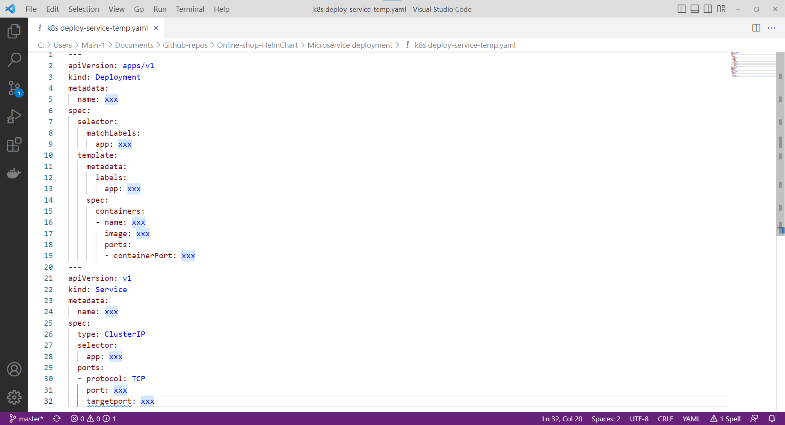

- Let's start implement the first service "Currency Service" starting by naming the service then implementing which image we will be using and it's important to use specific tag name for each one and not leaving it for latest to avoid any miss communication between the service for different versions.


##  4. <a name='Implementingalltheservices.'></a>Implementing all the services.
- Then we will repeat the same steps and the end result will be [like this](Microservice%20deployment/config.yaml).

##  5. <a name='ApplyingKubernetesbestPractices.'></a>Applying Kubernetes best Practices.
- But considering what we have done so far isn't following the recommended best-practice for Kubernetes because we have to assign image-tag and resources limits for each image, you can read more about [Kubernetes best practices: Resource requests and limits](https://cloud.google.com/blog/products/containers-kubernetes/kubernetes-best-practices-resource-requests-and-limits).

- By editing our existing config we will also add DISABLE_TRACING , DISABLE_PROFILER attributes recommended by [google](https://github.com/GoogleCloudPlatform/microservices-demo/issues/359) if you're working outside GCP.

- You can check the full deployment yaml with best-practice implementation [Here](Microservice%20deployment/config-include-best-practice.yaml).

- Now after we done with our config we're ready to apply it to any cloud platform of our choice, I will go with 
[Linode](https://www.linode.com).

- Choosing the right plan for your clusters i will go with 3 cluster.

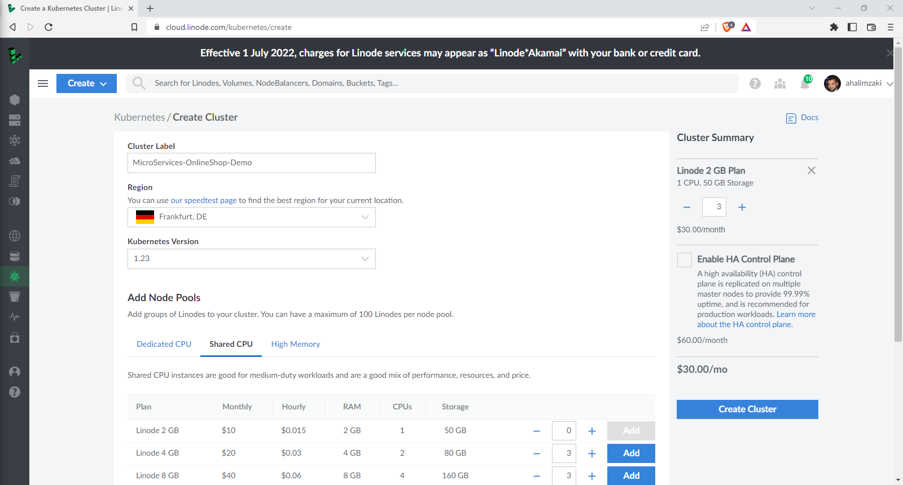

- After that I'll deploy it to the clusters.

- Creating a new name space for the microservices by the following command.

```kubectl create ns online-shop-microservices ```
- The following command will deploy the microservices to the cluster.

``` kubectl apply -f config-include-best-practice.yaml -n online-shop-microservices```

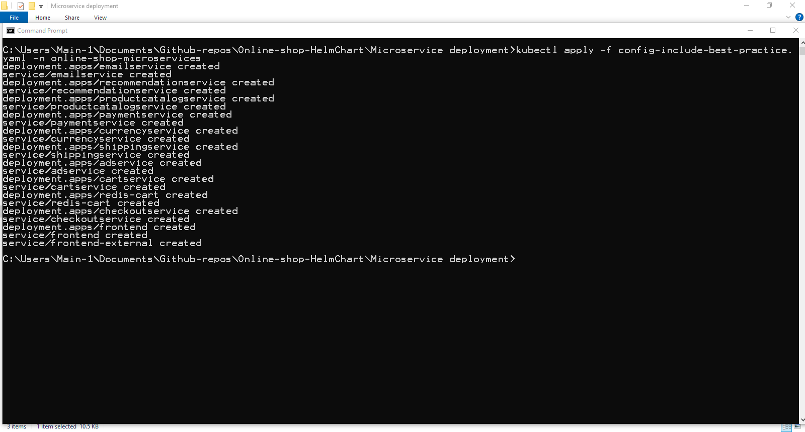

- After few minutes checking pods and svc status.

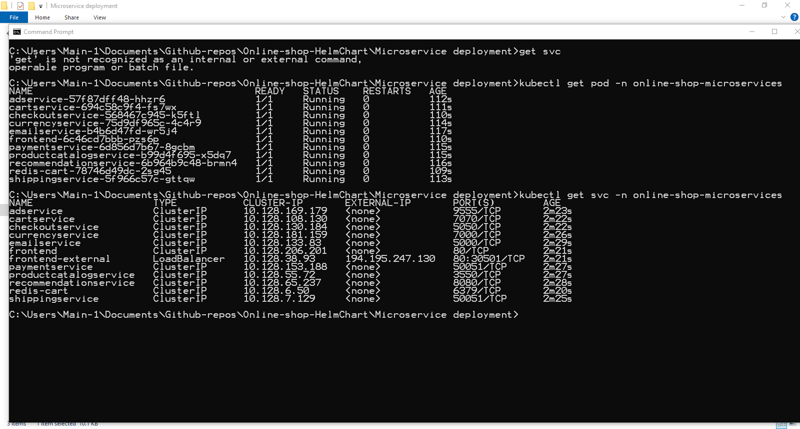

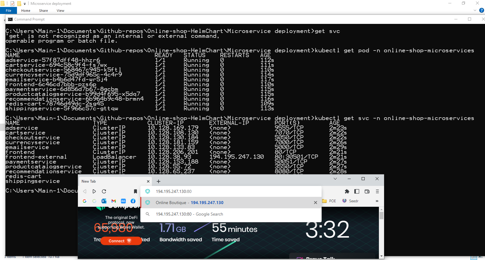
- To access the website I will use the public ip provided to the LoadBalancer which is "194.195.247.130:80" with the port 80
- The first interaction with the website working fine.

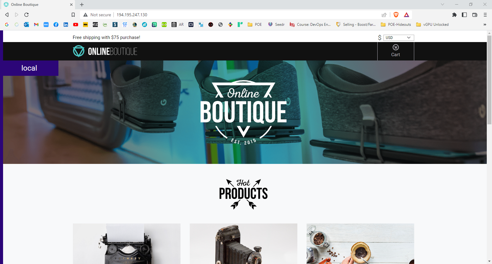


##  6. <a name='TransformtheK8sconfigtoHelmChart.'></a>Transform the K8s config to HelmChart.

###  6.1. <a name='WritingdowntheHelmChart.'></a>Writing down the HelmChart.
- I can generate helm template by using this command.

``` helm create microservice ```

-It will create a folder called microservice and it will generate the necessary files.

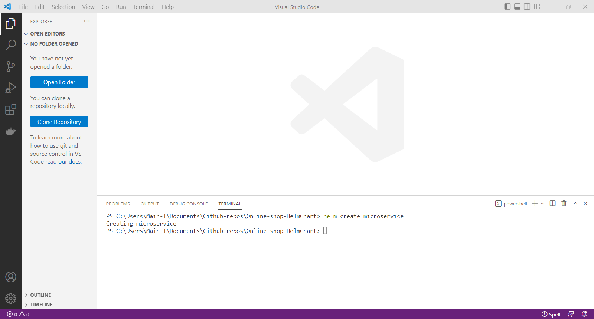

- By using the generated files by helm we can adjust it to meet our needs I will start by making a template with variables that fit my deployment and service.
- Mentioned earlier I will use the similar template but we will make it more generic [Deployment template](Helm%20Charts%20-%20Deployment/charts/microservice/templates/deployment.yaml) .

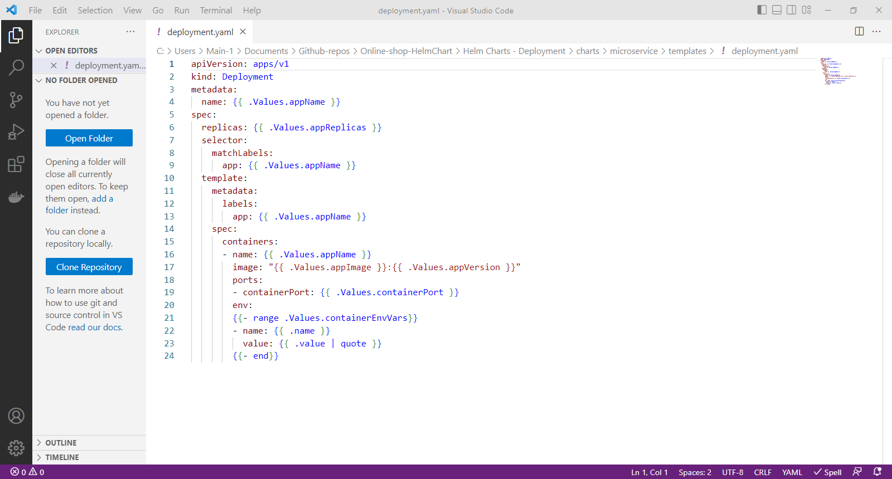

- [Service template](Helm%20Charts%20-%20Deployment/charts/microservice/templates/service.yaml) .

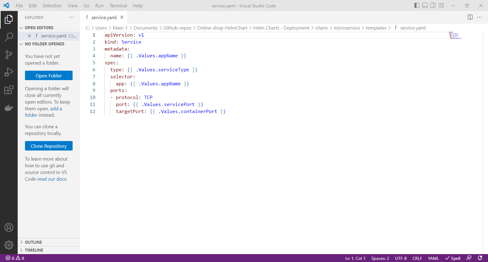

- By adjusting each service to a value file I grouped them inside [Values](Helm%20Charts%20-%20Deployment/values) folder and each named with service name.

- After that I created a helm file to install all the services.

- [Helm File](Helm%20Charts%20-%20Deployment/helmfile.yaml).

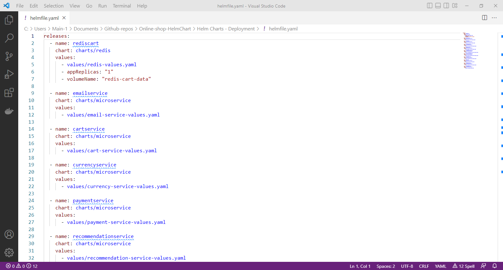

### Deploying The HelmChart

- I'll Install it on clean cluster statue by using helmfile package for deploying helm charts.

```helmfile sync```

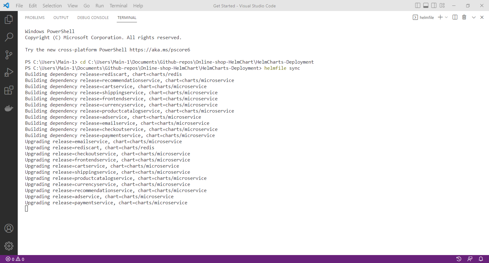

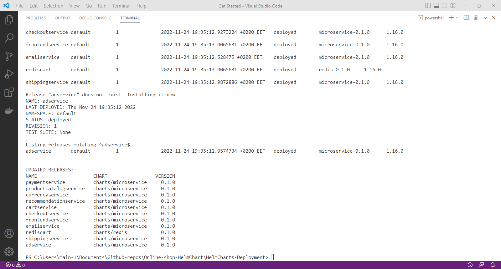

- Then checking the deployed microservices by using.

```helm ls```

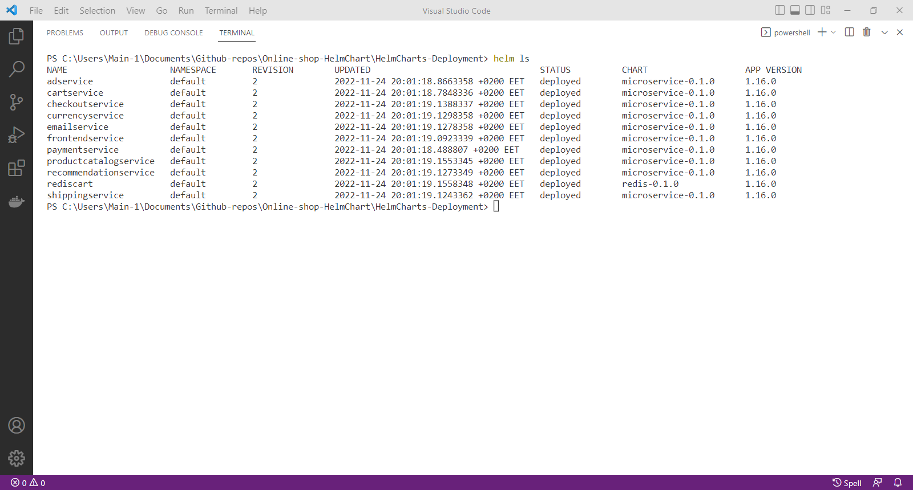

- Checking pod status.

```kubectl get pod```

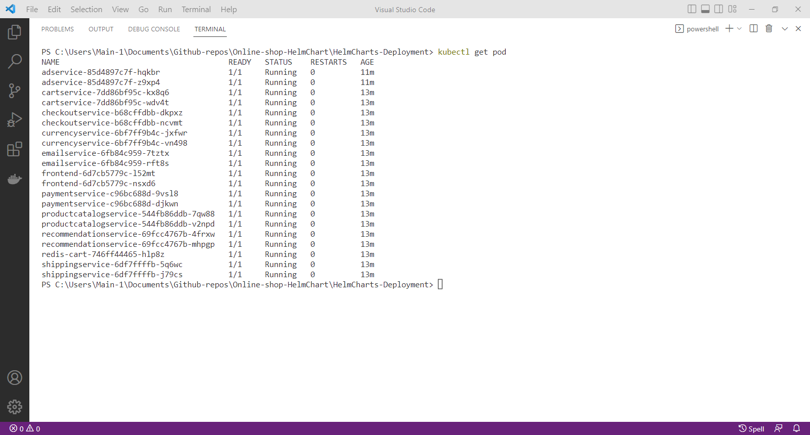

- Checking services.

``` kubectl get svc```

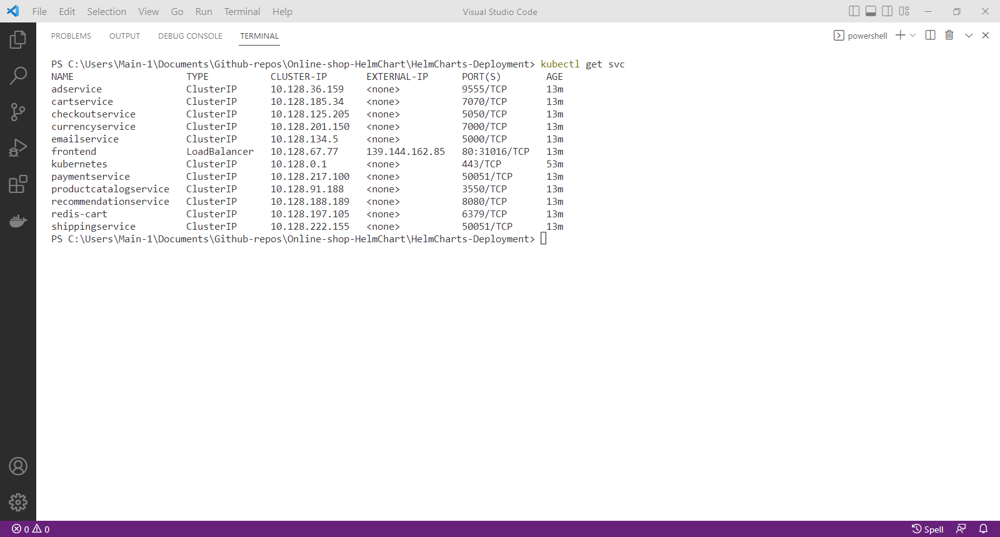
